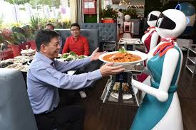
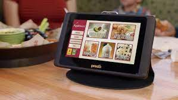

+++
title = "Cafe Renovation Ideas"
date = "2022-10-16T12:01:00"
author = "Abhinav Singh"
discord = "Fallen Faith#5556"
+++

## If I could renovate the *Café* for a day I would-
```md
1. Fix the Seating Plan
2. Get a Robot Staff
3. Enable Online Placing of Food
4. Develop a Credit System (gotta make that cash roll in ;) )
5. Birthday Offer
```

### 1. Fix the Seating Plan
I would definitely buy more tables and chair. Its an **arduous** task to find a place where you and your friends* can sit together.
<p align="center">
  
</p>

> *=imaginary

### 2. Get a Robot Staff
Everything should work *fast* and *smoothly*. For that wouldn't a robot staff be cool?!
<p align="center">
  
</p>

### 3. Enable Online Placing of Food
Tablets would be provided at the table through which one can order food and it would also be provided to them at their tables by the robot staff!
<p align="center">
  
</p>

### 4. Develop a Credit System 
With every order the customer will receive credits and these credits can work in either of these two ways-
* The one with the most credits at the end of the day will receive a special prize, like an *"Amazon gift card."*
* With the scored credits one can buy a food item, depending on how much the food item costs.

> I had no idea what image to put here so here is a picture of a really cute panda ʕ•́ᴥ•̀ʔっ♡ 

<p align="center">
  
</p>

### 5. Birthday Offer
If someone has their birthday that day, the person along with their friends will get ***FREE FOOD!!!***
<p align="center">
  
</p>
